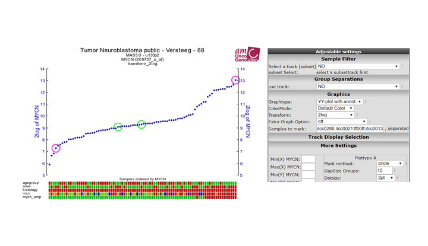

Workflows
===========================================

*Typical workflows that explore the combinations of analysis possible in R2*

Workflow: Generate a direct link to a public dataset in R2
-----

If you would like to include a direct link to a public dataset in R2, then you can follow the procedure described here.

1.  Make sure that you are NOT logged in with your own account. So log off in case that you are logged in.
2.  Navigate to the dataset to which you would like to create a link. You can use the 'change dataset' link in 'box 2' for this.
3.  Finally, click on the 'goto main' link in the upper left corner of the screen.
4.  The web address that will now appear can be copied directly and be provided as a refeerence to the dataset.

Workflow: Marking samples in a YY or XY plot
-----

1.  Marking a single sample

	With the ‘samples to mark’ option, you can make samples stand out. The easiest is marking a single sample using the R2 default setting. Make sure that you add a samplename (e.g. itcc0288) from the current dataset and press ‘redraw’. The indicated sample is now highlighted by an orange line.

[**Figure 1: Mark a single sample**](_static/images/marksam_001.png)

<form name="mark_single_sample" action="https://hgserver1.amc.nl/cgi-bin/r2/main.cgi" enctype="multipart/form-data" target="R2" method="post">
  <input type="hidden" name="option" value="display2">
  <input type="hidden" name="table" value="ps_avgpres_nbadam88_u133p2">
  <input type="hidden" name="graphtype" value="YY">
  <input type="hidden" name="cortype" value="transform_2log">
  <input type="hidden" name="factor" value="209757_s_at">
  <input type="hidden" name="factor2" value="209757_s_at">
  <input type="hidden" name="marksam" value="itcc0288">
  <button type="submit">Show me</button>
</form>

2.  Types of markings

	We can change the type of mark by changing the mark method from ‘dot’, to one of the other methods. ‘circle’ will draw an open circle around the sample; epicenter will draw a range of larger circles around the marked patient; and ‘arrow’ will place an arrow pointing to the sample.

[**Figure 2: Mark options**](_static/images/marksam_002.png)

<form name="mark_single_sample_epi" action="https://hgserver1.amc.nl/cgi-bin/r2/main.cgi" enctype="multipart/form-data" target="R2" method="post">
  <input type="hidden" name="option" value="display2">
  <input type="hidden" name="table" value="ps_avgpres_nbadam88_u133p2">
  <input type="hidden" name="graphtype" value="YY">
  <input type="hidden" name="cortype" value="transform_2log">
  <input type="hidden" name="factor" value="209757_s_at">
  <input type="hidden" name="factor2" value="209757_s_at">
  <input type="hidden" name="exageratemark" value="epicenter">
  <input type="hidden" name="marksam" value="itcc0288">
  <button type="submit">Show me</button>
</form>	

3.  Coloring and marking multiple samples

	Marking more than 1 sample is achieved by ’,’ separation (e.g. itcc0288,itcc0021,itcc0013,itcc0132).
Thus far all have been of the same color. We can also change the color of the marker by adding ‘:’ followed by a hex color (e.g. itcc0288,itcc0021,itcc0013,itcc0132:00ff00).

[**Figure 3: Mark and color multiple samples**](_static/images/marksam_003.png)

<form name="mark_multi_sample_circle" action="https://hgserver1.amc.nl/cgi-bin/r2/main.cgi" enctype="multipart/form-data" target="R2" method="post">
  <input type="hidden" name="option" value="display2">
  <input type="hidden" name="table" value="ps_avgpres_nbadam88_u133p2">
  <input type="hidden" name="graphtype" value="YY">
  <input type="hidden" name="cortype" value="transform_2log">
  <input type="hidden" name="factor" value="209757_s_at">
  <input type="hidden" name="factor2" value="209757_s_at">
  <input type="hidden" name="exageratemark" value="yes">
  <input type="hidden" name="marksam" value="itcc0288,itcc0021,itcc0013,itcc0132:00ff00">
  <button type="submit">Show me</button>
</form>

4.  Defining sample groups

	The previous example made all 4 samples green. We can also define groups and define different colors to every group. Groups are separated by ‘;’. To color our previous example with 2 groups, each having a different color, we define the following: itcc0288,itcc0021:ff00ff;itcc0013,itcc0132:00ff00

[**Figure 4: Mark with sample groups**](_static/images/marksam_004.png)

<form name="mark_group_sample_circle" action="https://hgserver1.amc.nl/cgi-bin/r2/main.cgi" enctype="multipart/form-data" target="R2" method="post">
  <input type="hidden" name="option" value="display2">
  <input type="hidden" name="table" value="ps_avgpres_nbadam88_u133p2">
  <input type="hidden" name="graphtype" value="YY">
  <input type="hidden" name="cortype" value="transform_2log">
  <input type="hidden" name="factor" value="209757_s_at">
  <input type="hidden" name="factor2" value="209757_s_at">
  <input type="hidden" name="exageratemark" value="yes">
  <input type="hidden" name="marksam" value="itcc0288,itcc0021:ff00ff;itcc0013,itcc0132:00ff00">
  <button type="submit">Show me</button>
</form>

5.  Advanced usage

	As a default, the mark method will be defined from the dropdown box as we have used in step 2. However, you can also define the method within the 'samples to mark' box by adding another ':' after the color representation. Defining this will overrule the default setting, and thus also enable the use of different markings within the same figure. So the skeleton for advanced usage is : 
'sample1,sample2:color1:method1;sample3,sample4:color2:method2'. For example: '"itcc0288:0000ff:dot;itcc0021:ff00ff:arrow;itcc0013,itcc0132:00ff00:epicenter"' creates the markings as shown in the figure.

[**Figure 5: Mark with advanced options**](_static/images/marksam_005.png)

<form name="mark_group_sample_circle_advanced" action="https://hgserver1.amc.nl/cgi-bin/r2/main.cgi" enctype="multipart/form-data" target="R2" method="post">
  <input type="hidden" name="option" value="display2">
  <input type="hidden" name="table" value="ps_avgpres_nbadam88_u133p2">
  <input type="hidden" name="graphtype" value="YY">
  <input type="hidden" name="cortype" value="transform_2log">
  <input type="hidden" name="factor" value="209757_s_at">
  <input type="hidden" name="factor2" value="209757_s_at">
  <input type="hidden" name="exageratemark" value="yes">
  <input type="hidden" name="marksam" value="itcc0288:0000ff:dot;itcc0021:ff00ff:arrow;itcc0013,itcc0132:00ff00:epicenter">
  <button type="submit">Show me</button>
</form>

---------
  **Did you know box**
  

>*R2 knows a couple of mark options, that you can make use of in the advanced prescriptions:* 
 - *'dot': places a thick border around the sample*
 - *'circle': Places a ring around the sample (diameter 9)*
 - *'circle_2': Places a ring around the sample (diameter 4)*
 - *'circle_3': Places a ring around the sample (diameter 1), effectively a thin border*
 - *'epicenter': Places a set of 3 rings descending in width around a sample*
 - *'arrow': Places a block arrow pointing to the sample*
 - *'triangle': Places a filled triangle under the sample*

>*Note: The dotsize does not scale with 'arrow' and 'triangle' method.*

Workflow: Drawing lines between samples in an XY plot
-----

1. Drawing a line between 2 samples

	To indicate a relation between different samples within a dataset it can sometimes be informative to add a line between samples. One can think of a pair for example, or perhaps a temporal relationship such as an on-off state or a time series. Within the XY plot of R2, we have a variable called 'sample paths', which can be used to add a line between samples. The easiest example, is to connect 2 samples within a plot. 

---------

Workflow: Final Remarks
-----

For description of many functions in R2, we have assembled a tutorial book, which can be found at [r2-tutorials](http://r2-tutorials.readthedocs.io/en/latest/index.html "R2 turorials at ReadTheDocs").

  

